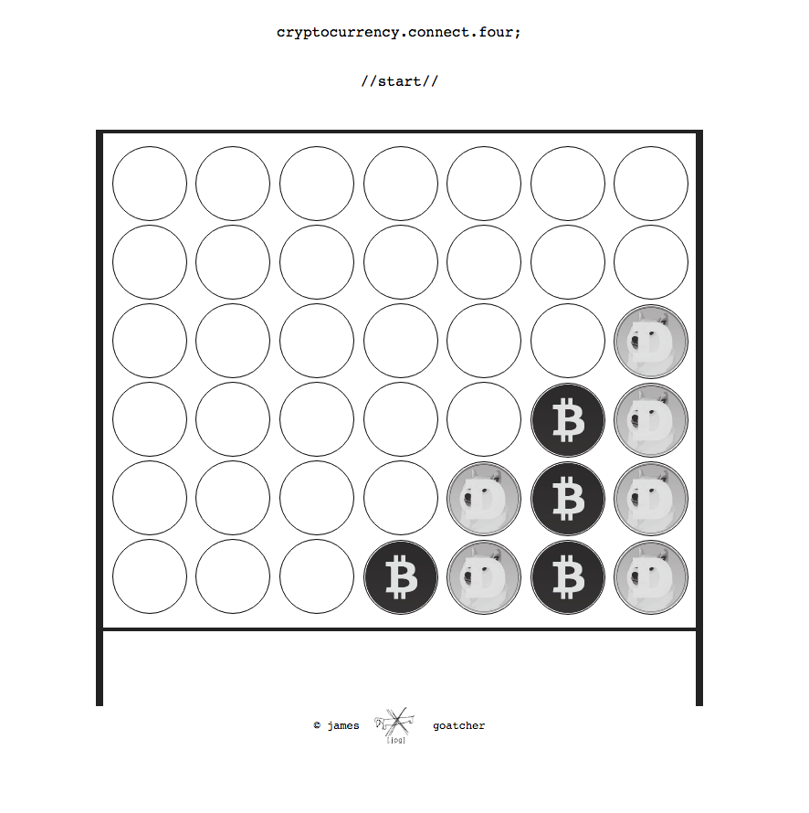

# connect-four_jpg

## Synopsis
A spin on the classic two player game written in JavaScript

---
## Necessary Features
* The user should be able to ‘click start’ to begin the game.
* The user should see the game board appear along with an input field.
* The user should be able to input his name and then player 2’s name.
* The user should be aware that it is his turn by seeing a message stating it is Player One's turn.
* The user should be able to click on a column and dispense their coin to the lowest open space once every turn.
* The game should alternate between players.
* The user should be able to win the game if 4 coins are matched in a row in any direction.
* The user should be notified of who is the winner, who is the loser, or if it is a tie.

* The start button should stylishly make the game board appear.
* The start button should disappear and turn into a name form for Player 1 to input.
* The Player 1 name form should disppear and turn into a Player 2 name form to input.
* Coins should animate from the top of the page to their desired place in the column upon click.
* A sleek announcement should generate over the board upon winning condition announcing the results.
* A reset button should appear upon completion that clears the board and restarts the game.

## Stretch Features
* An intro animation or gif should generate at the start and end for comedic effect.
* Cash-register noises should be added when Bitcoins are dropped and dog barks should sound when Doge-coin is dropped.
* The user should have the ability to disable sound effects.
* Additional in-trend graphic design should be applied to the page.